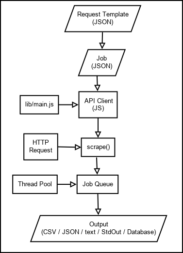

# Scrape Query
This is simple aggregation framework for web data using javascript.

This framework need `request_template` and `job` meta data to be passed to highest level API defined in `lib/main.js`. The `request_template` and `job` meta data must be javascript `object` type. You can define `request_template` and `job` meta data as JSON files, parse them as `object`, then call `scrape()` from `lib/main.js`.



Lets describe each competent one by one:
- **request_template** describe web scrapping logic. You can put many websites as you want differentiate with `id`.
- **job** describe web scraping execution. You can create many jobs as you want differentiate by `id`. Each job may execute multiple `request id` defined in `request_template` by stored them into `request` field as array.
- **API Client** describe which `job` should be executed by `lib/main.js`.
- **scrape()** is a highest level API defined by `lib/main.js` which maintain all web request objects.
- **Job queue** is a job que manager which manage and execute web request objects.

## How to use?
Below recommended step by step how you use this tool:

1. Create `request_template` meta data as JSON file. Put it in `input` directory if you want straight forward implementation or any directories in your project. The `request_template` meta data should follow any rules defined in [request documentation](docs/request.md). Below an example of `request_template`:
    ```
        {
            "<REQUEST_ID>":
            {
                "url": <URL>,
                "fillable": ["qs.<KEY>", "qs.<KEY>", ..., "qs.<KEY>"],
                "method": "GET",
                "selector": {
                    "<SELECTOR_ID>": "<SELECTOR>"
                }
            },
            ....
        }
    ```

2. Create `job` meta data as JSON file. Put it in `input` directory if you want straight forward implementation or any directories in your project. The `job` meta data should follow any rules defined in [job documentation](docs/job.md). Below an example of `job`:
    ```
        {
            "<JOB_ID>" : {
                "type": "JOB_TYPE",
                "request": [
                    {
                        "<REQUEST_ID>": {
                            "fill": {
                                "qs.<KEY>": <INPUT>,
                                ...,
                                "qs.<KEY>": <INPUT>
                            }
                        }
                    }
                ],
                "cache": 1,
                "output": {
                    "type": "<OUTPUT_TYPE>",
                    "name": "<OUTPUT_NAME>",
                    "format": {
                        "<KEY>": "<COMMAND>",
                        ...,
                        "<KEY>": "<COMMAND>"
                    }
                },
                "priority": <PRIORITY_LEVEL>,
                "delay": <DELAY_MS>,
                "thread": <NUMBER_OF_THREAD>,
                "status": <JOB_STATUS>
            },
            ...
        }
    ```

3. Create new API client as javascript file in one of this directory:
    - **test** directory if you want to do unit testing.
    - This root directory if you want to straight forward implementation.
    - Your project directory where you can access `web-aggregation/lib/main.js`.

    Below an example of API client if you create it in this root directory:
    ```
        const fs = require('fs');
        const path = require('path');
        const scraper = require('lib/main.js');

        let jobs = JSON.parse(fs.readFileSync(
            path.join(__dirname, '..', 'examples', <JOB_JSON_FILE>),
            'utf8')
        );
        let requestTemplates = JSON.parse(fs.readFileSync(
            path.join(__dirname, '..', 'examples', <REQUEST_JSON_FILE>),
            'utf8')
        );

        scraper.scrape(jobs, requestTemplates);
    ```

4. If you are in straight forward implementation, then just execute your API client: `node path/to/client.js`.

5. Create queue management dashboard to monitor job status by execute `node_modules/kue/bin/kue-dashboard -p 3050 -r redis: //127.0.0.1:3000`

## Examples
* Go to [**example directory**](examples) for working JSON example.
* Go to [**test directory**](test) for working script example.

## Documentation
* Go to [**docs directory**](docs) for straight forward guides. 

## Libraries
* [cheerio](https://github.com/cheeriojs/cheerio).
* [jsonframe-cheerio](https://github.com/gahabeen/jsonframe-cheerio).
* [json-query](https://github.com/mmckegg/json-query).
* [kue](https://github.com/Automattic/kue).

## Requirements
* [mongodb](https://www.mongodb.com/).
* [redis](http://redis.js.org/).

## Kue dashboard
node_modules/kue/bin/kue-dashboard -p 3050 -r redis: //127.0.0.1:3000